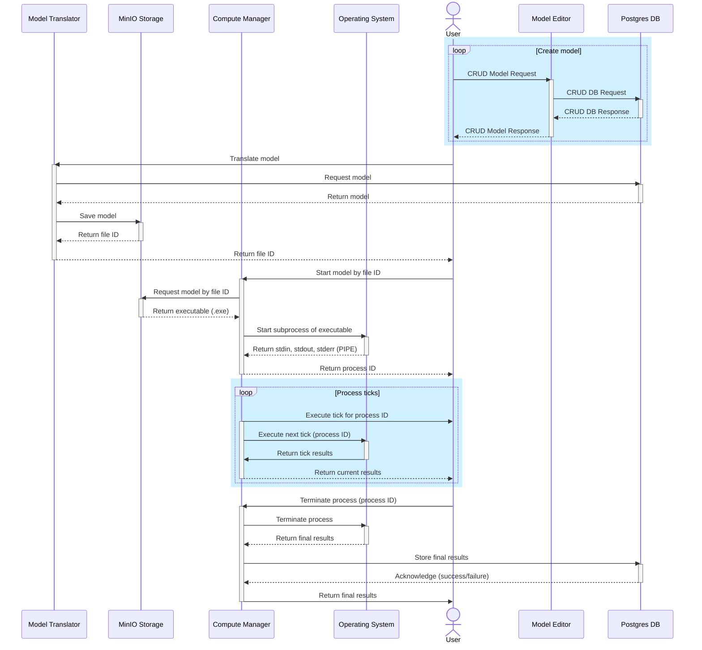

# AT Simulation API

Микросервис подсистемы имитационного моделирования АТ-ТЕХНОЛОГИЯ

## Общая схема вычислений

TODO: Общая схема верна, но детали немного устарели и нужно ее обновить.

## Локальный запуск

1. Установить и запустить сервис авторизации https://github.com/grigandal625/AT_USER по ридми, создать в нем пользователя
2. `git clone https://github.com/leerycorsair/at_simulation_api` и `cd at_simulation_api`

3. **Если делали это в AT_USER, пропускаем:** Установить Docker
4. **Если делали это в AT_USER, пропускаем:** Установить и запустить RabbtMQ (можно в докере, с открытием портов и с доступом RabbitMQ на localhost)
5. Установить python-пакет `poetry`
6. `poetry install`
7. `poetry update`
8. Скопировать файл [docker/local/.env.example](./docker/local/.env.example) в файл `docker/local/.env` (создать с тким же содержимым), и если надо, поменять настройки
9. `chmod +x ./alembic_upgrade_head.sh`
10. `./alembic_upgrade_head.sh`
11. **Если делали это в AT_USER, пропускаем:** Если нигде больше не запущен пакет `at_queue`, выполнить в отдельном терминале в этой же директории `poetry run python -m at_queue` (запустится только если запущен RabbitMQ, до конца раоты не выключать)
12. `make components`
13. `make run` - запустится бэкенд на адресе http://0.0.0.0:8081 или http://127.0.0.1:8081
14. запустить фронтенд на http://127.0.0.1:5000/ командой `docker run --name at-simulation-front -d -p 5000:5000 -e PORT=5000 -e API_PORT=8081 grigandal625/at-simulation-subsystem-front:latest`
15. Получить токен пользователя из сваггера AT_USER (пункт 1.)
16. 